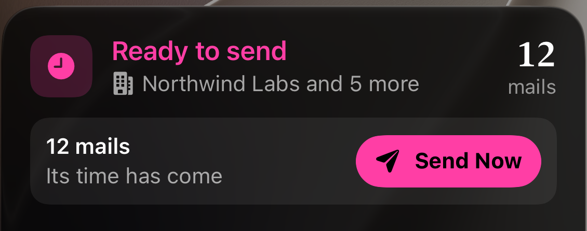
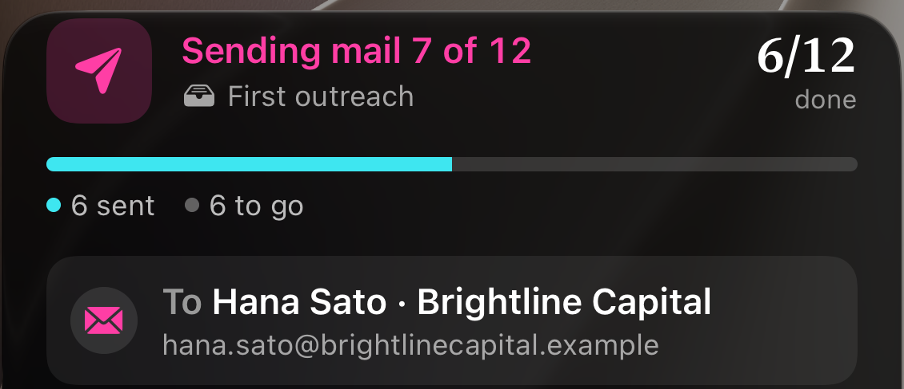
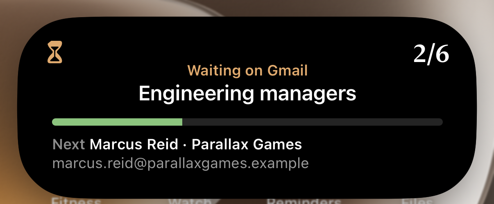

<h1 align="center">Aurora</h1>

<p align="center">
  <b>Cold-mail recruiters from your own Gmail, and see who wrote back.</b>
</p>

<p align="center">
  
  
  
  
</p>

<p align="center">
  &nbsp;
  &nbsp;
  
</p>

<p align="center"><a href="SCREENSHOTS.md">All screenshots →</a></p>

Aurora keeps a list of target companies and the people at each, writes
personalised mails from templates, sends them in batches from your own Gmail
account, and reads the threads back to find replies and bounces. It is a
SwiftUI app for iOS 27, backed by [Supabase](https://supabase.com), with mail
sent and read through the Gmail API under Google OAuth.

## Contents

- [Features](#features)
- [Getting started](#getting-started)
- [How it works](#how-it-works)
  - [Sending](#sending)
  - [Live Activity](#live-activity)
  - [Rate limits](#rate-limits)
  - [Reply tracking](#reply-tracking)
  - [Bounces](#bounces)
  - [Greetings](#greetings)
- [Architecture](#architecture)
- [Design system](#design-system)
- [Testing](#testing)
- [Scripts](#scripts)
- [Project layout](#project-layout)
- [Privacy](#privacy)

## Features

| | |
|---|---|
| **Companies and contacts** | A company can have several mail domains (`stripe.com`, `stripe.dev`). Adding a contact looks up the domain of their address and suggests the company already on file, so the same company isn't entered twice. |
| **Templates** | Subject and body with placeholders (`{Receiver-Name}`, `{Receiver-Company}`, `{Sender-College}`, `{Resume-Link}`, …) filled from the contact and your profile. The editor flags misspelled placeholders and ones that would come out blank. A template that names one company in plain text is labelled with it, and compose warns before it goes to anyone else. |
| **Greetings** | "Hi {Receiver-Name}," greets people by a name that's plainly there: the contact's name field, the name they signed a reply with, what your own mail calls their address, or an address that spells the given name out (`anjali.kumari@`). Nothing is guessed: otherwise the mail opens with a plain "Hi," and the app shows "Name not detected". See [Greetings](#greetings). |
| **Compose** | One screen per batch: who it's going to, a row of templates, and a swipeable deck of the actual mails. Any mail can be edited by hand or moved to another template. Batches have no size limit. |
| **Mail queue** | Sends go into a queue saved on the phone. It survives the app closing, can be paused and resumed, and can hold batches scheduled for later. When Gmail rate-limits a send or the connection drops, the queue waits and carries on by itself. Nobody is ever mailed twice: a mail Gmail may already have is looked for in Sent before it can go again, and tests interrupt the queue at every stage to prove it. |
| **Live Activity** | While mail is sending, the Lock Screen, Notification Center and Dynamic Island show what the queue is doing ("Sending mail 4 of 6", "Connection lost · retrying in 0:05"), a progress bar, and who the mail is going to. One activity follows the queue through pauses and retries, and a scheduled batch shows a countdown, then a Send Now button when its time comes. |
| **Reply tracking** | Each send records its Gmail thread. The app reads those threads to find replies, skipping auto-replies and bounces. |
| **Bounce detection** | Undelivered mail is found in its thread or in the inbox, matched to the exact send by the `Message-ID` the failure notice quotes, and listed with the reason its status code gives. Answers saying the address is no longer in service, or the person has left, count too. Any sent mail can be checked on its own from Activity. |
| **Activity** | Every mail from queued to answered, in four lanes: Queued (the mail queue, with every queue control), Sent (by day), Replied and Bounced. The Bounced lane lists bounced addresses, with a button to mark each (or all) invalid; the tab shows a badge while any are waiting. |
| **Themes** | Six looks in Settings: Aurora, Tide, Phosphor, Neon, Bloom and Gilded. Each changes the colours, the chart that moves behind every screen, the launch screen and the app icon. |
| **Send animation** | Sending launches paper planes, one per mail (up to three), that climb on glowing trails, loop and fly off the top of the screen. |
| **Invalid contacts** | A contact whose address bounces or who has left can be marked invalid, and isn't mailed or suggested again until marked valid. Shared across users, since a dead address is dead for everyone. A company's contacts are split into Valid and Invalid lists, one at a time. |

## Getting started

**Requirements:** Xcode with the iOS 27 SDK, a Supabase project, and a Google
Cloud OAuth client for iOS.

1. Open `Aurora.xcodeproj`.
2. Fill in [`Aurora/AppConfig.swift`](Aurora/AppConfig.swift):
   - `supabaseURL`, `supabaseAnonKey`
   - `googleClientID`, `googleRedirectScheme` (the reversed client ID)
3. Apply the [database schema](#database-schema) to your Supabase project.
4. Run on a simulator or device. Scheduled sends ask for notification
   permission the first time you schedule something. The `AuroraLive` widget
   extension (`com.realaryan.JTracker.LiveActivity`) is signed with the same
   team; on a first device build, let automatic signing register its app ID.

### Database schema

Changes the app expects, newest first. Run them in the Supabase SQL editor; each
is safe to re-run.

```sql
-- Company mail domains (e.g. {stripe.com, stripe.dev}). A company can have
-- several; the app adds a contact's work domain to its company automatically,
-- and suggests the company from the domain when a contact is added. The
-- backfill seeds each company with the work domains its contacts already use.
alter table companies
  add column if not exists domains text[] not null default '{}';
create index if not exists companies_domains_idx on companies using gin (domains);
update companies c
set domains = sub.domains
from (
  select company_id, array_agg(distinct lower(split_part(email, '@', 2))) as domains
  from recruiters
  where email like '%@%.%'
    and lower(split_part(email, '@', 2)) not in (
      'gmail.com', 'googlemail.com', 'yahoo.com', 'yahoo.co.in', 'ymail.com',
      'outlook.com', 'hotmail.com', 'live.com', 'msn.com', 'icloud.com', 'me.com',
      'mac.com', 'aol.com', 'proton.me', 'protonmail.com', 'rediffmail.com',
      'zoho.com', 'gmx.com', 'mail.com', 'yandex.com')
  group by company_id
) sub
where sub.company_id = c.id and c.domains = '{}';

-- Per-contact greeting override: what goes after "Hi " when the name field
-- can't produce it on its own ("A Bagarwal", a role mailbox). Null derives the
-- greeting from the name and address instead.
alter table recruiters
  add column if not exists greeting_name text;

-- Reply tracking. Gmail's ids for each send, and what came back.
alter table mail_sends
  add column if not exists gmail_message_id text,
  add column if not exists gmail_thread_id  text,
  add column if not exists replied_at       timestamptz,
  add column if not exists reply_from       text,
  add column if not exists reply_snippet    text;

create index if not exists mail_sends_thread_idx
  on mail_sends (user_email, gmail_thread_id);

-- Contacts that bounce, or whose owner has left the company.
alter table recruiters
  add column if not exists is_valid boolean not null default true;
```

The app still runs if some of these haven't been applied yet:

- Without `greeting_name`, greetings are worked out from the name and address,
  and a greeting typed into the contact form is dropped while the rest of the
  edit saves.
- Without the reply-tracking columns, sends are recorded without Gmail ids and
  no replies are found. The status line on Activity says so.

The mail queue needs no schema change; it's stored on the phone.

### Google OAuth

The app asks for `gmail.send` and `gmail.readonly`. The read scope is what
reply tracking, bounce detection, the queue's Sent-mail lookups and the
greeting lookups use.

- If you connected Gmail before reply tracking existed, disconnect and reconnect
  it in Settings. Older tokens don't have the read scope, and reads fail with a
  403 until you do.
- `gmail.readonly` is a restricted scope. It works for listed test users while
  the consent screen is in Testing. Publishing requires Google's verification
  and a yearly security assessment.
- An OAuth app in Testing gets refresh tokens that expire after seven days.
  When that happens, a running batch pauses and asks you to reconnect.

## How it works

### Sending

#### Compose

A letter on the compose screen is just a contact plus the template it uses (or
the text you rewrote it with). Its text is only produced when its card is on
screen, so opening a batch of 150 or switching its template doesn't render 150
mails. Blank placeholders, missing subjects and wrong-company templates are
counted without rendering anything, and the send button says what's wrong.

Anyone already waiting in the mail queue (or sent by it and not yet in the
history) is left out of a new batch, with a note saying how many.

Tapping another template answers at once: its tile shows a spinner and the
deck dims for a moment while the letters move onto it, then fades back in on
the new words. The letters move without animation; animating every visible
letter's text as it reflowed was what made switching stutter.

#### The queue

Tapping Send (or Schedule) hands the batch to `MailQueue`, which stores it as:

- a copy of each template's subject and body as they were when you confirmed,
- one entry per person: address, name, company, the values their placeholders
  fill with, which template they use (or their hand-written text), and a status.

Each mail is rendered from that copy right before it's sent. Editing a template
afterwards doesn't change a batch that's already queued; what you reviewed is
what goes out. The batch is saved to `Documents/mail-queue-<account>.json`
after every change, at about 600 bytes per person. Finished batches are kept
for a week.

Mails go out one at a time, 1.2 s apart with some random jitter. Gmail would
accept them faster, but a burst of near-identical mail from a personal account
is what spam filters look for, and the damage lands on your own sending
reputation. Personal Gmail accounts can also only send a few hundred messages a
day.

Sends are written to the `mail_sends` history every 5 mails. Anything not yet
written when the app closes is written the next time it opens.

The shelf above the tab bar shows what the queue is doing (sending, paused,
due, scheduled, or the last result). Tapping it opens Activity's Queued lane,
where every batch is listed by what it's doing. There each batch can be
paused, resumed, rescheduled, retried or removed (Activity → ⋯ → Clear Queue
empties it). Each batch lists the saved copies of its templates (flagged if the
template has been edited or deleted in Templates since), each person's row says
which one their mail is written from, and any mail can be opened to read
exactly what was or will be sent.

#### Interruptions

A mail is saved as `sending` before the request goes to Gmail and as `sent`
when Gmail answers. If the request is cut off in between, nobody knows whether
Gmail got it, and guessing wrong either way is bad: a second mail to the same
person, or a mail that never went. So the rule is: **a mail Gmail may have is
looked for in Sent mail before it can be sent again.**

- **The connection drops mid-request, or Gmail fails with a 5xx:** the mail
  stays `sending`, the batch pauses, and it carries on by itself after 5 s
  (then 10, 20, 40, 60 s, 2 and 5 minutes on each failure in a row; a mail
  going out resets the steps). After 12 in a row it waits for Resume.
- **The app is closed mid-send:** the batch comes back paused and carries on by
  itself a few seconds after the app opens.
- **Before anything else happens to a `sending` mail**, it's looked up in
  Gmail's Sent mail (`in:sent to:<address> after:<time it was handed over>`),
  after waiting ~20 s so Gmail's search has caught up, and, if it was cut off
  in the last 10 minutes and isn't there, once more 15 s later. If it's there,
  it's marked sent with its Gmail ids and recorded. If not, it goes back in
  line. If Sent can't be searched for it at all, it's marked failed and never
  resent, and Retry Failed leaves it alone too.
- **Only a refusal that proves Gmail took nothing** (a 400, a 429 rate limit,
  a refused or expired session) puts a mail back in line unchecked.
- **No one in two batches:** a new batch leaves out anyone another batch is
  mailing, has mailed but not yet written to the history, or who appears twice
  in it.

Pause (on the shelf or in the queue) lets the mail already in flight finish.
It doesn't cancel the request, because a request cancelled on the phone may
still have been delivered by Gmail. A paused batch never carries on by itself.

`Tests/MailQueueTests.swift` runs the real queue against a fake Gmail and
interrupts it at every one of these points (dropped before and after Gmail took
the mail, 5xx with and without it, rate limits, a 400 then Retry, Pause and
Resume, the app killed before and after Gmail took the mail and opened again,
with and without Sent search lag, overlapping batches), checking each person is
mailed exactly once. Nothing is sent anywhere.

#### Scheduling

The clock button next to Send schedules the batch instead: in an hour,
tomorrow at 9, Monday at 9, or any date and time.

iOS doesn't let an app run at a set time, so scheduling works the way Reminders
does: the app hands iOS a local notification for that time. Tapping it opens the
app on a summary of the batch (how many mails, which companies and templates,
who it's going to, roughly how long it will take) with a Send button. The same
summary appears if you open the app, or already have it open, once the time has
passed. Nothing is sent without that tap. "Not Now" leaves it on the shelf.

From seven hours before its time (iOS ends a Live Activity after eight), the
batch is also on the Lock Screen and in the Dynamic Island with a countdown.
When the time comes the activity turns into "Ready to send" with a **Send
Now** button by itself, even with the app asleep, and tapping it opens the app
and starts the batch with no further question.

<p align="center">
  
</p>

If you don't open the app or tap it, the batch waits. iOS doesn't let an app's
code run at a set time, and a Live Activity can't send mail on its own, so
sending at an exact time with the phone locked would need a server holding your
Gmail token, which this app doesn't have.

### Live Activity

<p align="center">
  <br>
  <br>
  
</p>

While the queue is sending, a Live Activity shows the run outside the app.
There is only ever one: it starts with a run (or a scheduled batch), follows
it from batch to batch, and stays through pauses and retries, so resuming
updates it rather than starting another. One a previous launch left up is
taken over. It ends showing how the run finished (a clean run stays on the
Lock Screen for 15 minutes).

- **Lock Screen and Notification Center:** the status in the theme's colour
  ("Sending mail 4 of 6", "Connection lost · retrying in 0:05", "Paused",
  "All 6 sent", "Scheduled for 7:00 PM", "Ready to send"), the batch's name
  under a tray icon, so it doesn't read as a status, a count ("3/6 done"), a
  progress bar with sent, failed and to-go counts, and a card saying who the
  mail is going to: their name, company and address. While the run waits, the
  card shows who goes next instead.
- **Dynamic Island, expanded:** the status, the batch, the count, who it's to
  and the bar, with margins all round.
- **Dynamic Island, compact:** the phase's glyph and the count, or the
  countdown while waiting, or a scheduled batch's time.

Tapping it opens Activity's Queued lane. It's drawn by the `AuroraLive` widget
extension from `SendActivityAttributes` (in `Shared/`, compiled into both
targets), and `SendLiveActivity` in the app starts, updates and ends it as the
queue changes. The extension can't read the app's theme, so the theme's colours
and mark travel with the activity. iOS asks once whether to allow Live
Activities from Aurora; they can be turned off in Settings › Aurora.

### Rate limits

When Gmail answers a send with a rate limit (HTTP 429, or a 403 whose reason is
`rateLimitExceeded`, `userRateLimitExceeded`, `dailyLimitExceeded` or similar),
nothing was sent: the mail goes back first in line. When Gmail is briefly
unavailable (5xx) it may have taken the mail before failing, so the mail stays
`sending` and is looked for in Sent first (see Interruptions). Either way the
run waits:

- for the time Gmail gave (a `Retry-After` header, or the "Retry after
  <time>" its message ends with), or
- if it gave none, for 30 s, then 1, 2, 4 and 8 minutes on each limit in a row.
  A send that goes through resets the steps.

The wait counts down on the batch, the shelf and the Live Activity, and Pause
still stops it. A wait longer than 15 minutes (a daily sending limit,
typically) isn't sat out: the batch pauses and carries on by itself at that
time (an hour later if Gmail didn't say), with a notification in case the app
is closed by then.

### Reply tracking

Reply state lives per user on `mail_sends`. `ReplySync` makes two passes over
Gmail:

1. For sends recorded without a thread id, it finds the Sent copy with an exact
   `in:sent to:… after:… before:…` search. If more than one mail could match,
   it leaves the send alone rather than attach the wrong thread.
2. It reads the headers of each unanswered thread and takes the first message
   that isn't yours. Your own messages (`SENT`/`DRAFT` labels), auto-replies
   (`Auto-Submitted`, `Precedence`, no-reply senders) and bounces
   (`mailer-daemon`/`postmaster` senders) are skipped.

Matching by thread instead of by sender address matters: replies often come
from a colleague or an applicant-tracking system, which keep the thread but not
the address.

Each account's checks are kept to new mail by a checkpoint saved on the phone
(`ReplyCheckpoint`, in `reply-checkpoint-<account>.json`): when a check has read
everything it tried, the time it began is stored, and the next check (on
launch, on returning to the app, or pulling to refresh) reads only the threads
with inbound mail since then, and searches for failure notices only since then,
with a 15-minute overlap. A check where any read failed leaves the checkpoint
where it was, so those threads are read again. An account's first check, and
the one after reconnecting Gmail in Settings, read everything.

The same check names the people you've mailed who have no name on file (an
empty name field, or the mailbox copied over). Its last step looks each such
address up in your mail (`MailboxNames`), and the name they signed a reply
with, or a header like `Aryan Kadian <kdaryan@acme.com>`, is saved to their
contact as "Aryan Kadian". The name is tidied first: surname-first entries
are turned round, and notes, honorifics and a trailing "| Acme" are dropped.
Display names that name a role or repeat the mailbox don't count. The write
only lands if the name field is still what it was, so a name typed in the
meantime is never overwritten. An address with nothing found is tried again
after a month.

The status line at the top of Activity says "Updating · Step 2 of 6 ·
Checking for replies · 12 of 80 mails (15%)" while a check runs, wrapped
rather than cut off, with a bar for the run as a whole, and "Status updated
4 minutes ago" once it's done. Tapping it opens **Status Updates**: when the
last check finished, where the next one starts reading, and a timeline of the
last 30 checks (`ReplyCheckLog`, kept per account on the phone), each with
when it ran, how long it took, how far back it read, and what every step did
("Read 12 threads with new mail since 3:04 PM · 2 replies", "Linked 3 of 5
sent mails to their threads", "Looked up 40 addresses · 6 named"). Anything
that couldn't be read is listed under its step with the reason, grouped:
"3 couldn't be read: Connection dropped". A check that stopped says why.

Gmail lets each user spend about 250 quota units a second, and reading a
thread costs 10. Read five at a time as fast as they'd go, a full check of
700-odd threads had about half of them refused. Those all showed up as
"couldn't be read", and kept the checkpoint from moving on. Reads are now paced
20 a second (`GmailReadPolicy`), and one Gmail turns away for the rate or a
moment's outage is tried again after the time Gmail asks, else 1, 2, 4 and 8
seconds, before it counts as failed. A thread deleted in Gmail is noted as
deleted, not as a failure. `Tests/GmailReadPolicyTests.swift` checks this
against a model of the limit: unpaced, a 731-thread check is refused 356
times; paced, never.

### Bounces

A bounce is found two ways during the same sync:

- **In the thread.** A failure notice that Gmail filed with the original mail,
  from a `mailer-daemon` or `postmaster` sender (or Exchange's
  `MicrosoftExchange329e71ec88ae4615bbc36ab6ce41109e` service account). The
  thread already says which send it was.
- **In the inbox.** Many servers send notices that never join the thread. The
  sync searches for the usual senders and the usual subjects ("Undeliverable",
  "Delivery Status Notification", "Returned mail", "Delivery failure", …) from
  the last 120 days, Spam and Trash included. It reads only the notices it
  hasn't seen before.

Either way, the notice is read whole (`format=raw`), not just its preview.
Most notices carry a machine-readable report (RFC 3464) that gives each failed
address, what happened (`Action: failed` or `delayed`), a status code (`5.1.1`)
and the receiving server's own explanation. They also quote the original
mail's `Message-ID`, which a `rfc822msgid:` search turns back into the exact
send. What the app does with that:

- Only `Action: failed` counts. "Delayed" reports are skipped, because Gmail
  is still retrying and most of those mails arrive in the end.
- The reason comes from the status code: `5.1.1` (and Exchange's `5.1.10`)
  address not found, `5.1.2` domain doesn't exist, `x.2.2` mailbox full,
  `5.7.x` rejected by their server's policy or spam filter.
- A notice is matched to the send its `Message-ID` names. Without one, it's
  matched by address, and then only to a contact who was mailed before it
  arrived.
- A mail whose subject says "Returned mail" but isn't a notice (no report, not
  from a mail server, no `X-Failed-Recipients`) is ignored.

Servers that send prose alone fall back to reading the text: the address from
`X-Failed-Recipients` or the prose, the reason from its wording and any status
code in it. All of this lives in `BounceParsing`, which has its own tests.

Some dead addresses never produce a failure notice. Instead the recipient's
side answers: their auto-responder, a colleague or the company's `noreply@`
says the address is "no longer in service", the mailbox "is no longer
monitored", or the person "has left the company". These read like replies, and
often arrive outside the mail's thread. `BounceParsing.isDeadAddressNotice`
recognises them (an out-of-office that says mail "isn't monitored" until
someone is back is not one), and they count as bounces with the reason "No
longer in service":

- in the mail's thread, such a message is a bounce rather than a reply (a real
  reply after it still wins);
- outside the thread, each sync searches the mailbox for these phrases and
  pins each message on one person mailed before it arrived: by its thread, by
  the address it came from, by an address it names, or by the company's domain
  when exactly one person there was mailed in the three days before;
- replies recorded before these were told apart are taken back in
  `mail_sends` and kept as bounces instead.

Check for Bounce on a single sent mail (its menu in Activity, or its page)
does the same for that one mail straight away: its thread first, then failure
notices anywhere in the mailbox that name its address.

Bounces are saved per account in `Documents/bounces-<account>.json`, so they
survive a relaunch. A bounce leaves the list when the contact is marked
invalid, when their address is changed, when they reply after it, or when you
tap Not a Bounce. A dismissed contact comes back only if a newer notice
arrives.

### Greetings

`{Receiver-Name}` is filled by `Contact.greeting`, which takes the first of
these that gives a name. None of them guesses:

1. **A greeting set on the contact** (`recruiters.greeting_name`).
2. **The contact's name field**, unless it only copies the mailbox
   ("Akushwah" for `akushwah@`). Honorifics, notes in brackets and
   surname-first entries ("KUMARI, Anjali") are handled, and initials
   ("A Kumari", "NS Acharya") fall through to the next word.
3. **The name they signed a reply with**: the `From:` of a reply from the same
   address, which reply tracking already reads.
4. **What your own mail calls their address.** `MailboxNames` looks each
   address up once in your Gmail, in mail from it and then mail to or copying
   it, and keeps a header like `Aryan Kadian <kdaryan@acme.com>`. It runs for
   your tracked companies after launch and for a batch's recipients as compose
   opens, and the results are cached per account on the phone.
5. **The address**, only when it separates a given name from the rest:
   `anjali.kumari`, `anjali_kumari` and `rahul.k` greet Anjali, Anjali and
   Rahul. A glued mailbox (`nehamathur`, `akushwah`), a lone word (`rahul`),
   initials first (`pm.singh`) and leetspeak (`talk2saravanan`) give nothing:
   there's no telling where one name ends and the next begins. An address
   written surname first (`kumar.rahul`) does greet Kumar; nothing short of a
   model could tell, and a model guessed wrong too often.
6. **Nobody**: the template closes up, so "Hi {Receiver-Name}," is sent as
   "Hi,". A wrong name costs more than no name.

When no name is detected, the app says so rather than leaving it to chance:

- **Compose** marks the letter "Name not detected — opens “Hi,”". **Add Name**
  saves the name you type as the contact's greeting and rewrites the letter;
  **Leave Empty** sends it with "Hi,". The send confirmation counts how many
  mails open that way.
- **Contact rows and the contact card** say "Name not detected" where the job
  title or address would go.
- **The contact form** says "Name not detected" under the fields, with the
  Greeting Name field right there to fill in or leave empty.
- **The template editor** warns when `{Receiver-Name}` is placed where an empty
  one would read oddly ("Dear ji,"), and shows how the line would read.

Display names that name a role ("Acme Recruiting") or only repeat the mailbox
never count. The catalog follows the same rule: a contact whose name can't be
read this way has an empty name field, the "name not detected" state (see
[`verify_names.py`](scripts/company_verification/README.md#name-pass-verify_namespy)).

## Architecture

| Layer | Where |
|---|---|
| UI | SwiftUI, `Aurora/Views`. `RootView` owns the stores and the tab bar. |
| State | `@Observable` stores in `Aurora/Models`: `JobStore`, `ProfileStore`, `TemplateStore`, `GmailAuthStore`, `ReplySync`, `MailQueue`, `MailboxNames` |
| Backend | Supabase (Postgres) through `SupabaseAPI` |
| Mail | Gmail API via `GmailAuthStore`: OAuth with PKCE, send, and read-only mailbox queries |
| Greetings | `RecipientName`, with `MailboxNames` for names found in your mail |
| Live Activity | The `AuroraLive` widget extension, drawn from `SendActivityAttributes` in `Shared/`; `SendLiveActivity` in the app starts, updates and ends it |
| On the phone | Keychain for the Google refresh token; JSON files in Documents for the mail queue, bounces, found names and a few cached lists (`JSONFile`) |

`MailQueue` and `ReplySync` don't reference the auth or data stores. `RootView`
passes them closures for sending, looking up Sent mail, recording sends and
reading threads. That keeps them independent of Gmail and Supabase, and let the
queue be exercised with a fake transport.

Tables: `companies`, `recruiters` (shared by all users), `mail_sends` (per
user), plus profiles and templates. Sent and reply state is overlaid onto the
shared contact rows after they're loaded.

`recruiters.is_valid` is shared on purpose and only written by
`SupabaseAPI.setContactValidity`, never by an ordinary contact edit. Correcting
someone's address can't quietly put them back in circulation.

## Design system

Dark only: a near-black background ruled as faint graph paper, light text, thin
rules, one accent colour (clay). Colours and type are in
`Support/Palette.swift`; surfaces, list styles, buttons, chips, metrics and
selection mode are in `Support/DesignSystem.swift`. Screens use those rather
than choosing their own colours or corner radii.

Conventions the code follows:

- Every card is the same surface, radius and hairline. No shadows.
- Colour only when it means something, shown as a strip down a card's left
  edge: olive for a reply, warmer for a longer silence, kraft for a warning.
- System serif for titles and numbers, system sans for everything else.
- Content is flat; controls floating over it use Liquid Glass.
- Sending, signing out and marking contacts valid/invalid always ask first.
  Editing sheets ask before discarding changes and can't be swiped away while
  they have any (`discardableEdits`).
- System components where they exist: `List` for lists (so swipes, context
  menus and multi-select behave like the rest of iOS), the system segmented
  control, the system bottom toolbar in selection mode.
- Long lists and decks are lazy, and state that changes often (like which
  letter is on screen) is kept where only the views showing it redraw.

## Testing

`Tests/` holds self-contained Swift programs that run without Xcode. Most carry
their own copies of the logic under test; the bounce, greeting, name-lookup,
mail-queue, reply-checkpoint and Gmail read-policy tests compile against the
app's own files.

```bash
swiftc Aurora/Models/BounceParsing.swift Tests/BounceParsingTests.swift -o /tmp/bt && /tmp/bt
swiftc Aurora/Models/RecipientName.swift Aurora/Models/MailTemplate.swift \
  Tests/RecipientNameTests.swift -o /tmp/rn && /tmp/rn
swiftc Aurora/Models/MailboxNames.swift Aurora/Models/RecipientName.swift \
  Tests/MailboxNamesTests.swift -o /tmp/mn && /tmp/mn
swiftc -parse-as-library -default-isolation MainActor \
  Aurora/Models/MailQueue.swift Aurora/Models/MailBatch.swift \
  Aurora/Models/MailTemplate.swift Aurora/Models/GmailAuthError.swift \
  Aurora/Support/JSONFile.swift Tests/MailQueueTests.swift -o /tmp/mq && /tmp/mq
swiftc -parse-as-library Aurora/Models/ReplyCheckpoint.swift Aurora/Models/ReplyCheckLog.swift \
  Aurora/Models/GmailAuthError.swift Aurora/Support/JSONFile.swift \
  Tests/ReplyCheckpointTests.swift -o /tmp/rc && /tmp/rc
swiftc -parse-as-library Aurora/Models/GmailReadPolicy.swift \
  Tests/GmailReadPolicyTests.swift -o /tmp/gr && /tmp/gr
swift Tests/ReplySyncTests.swift
swift Tests/EndToEndSyncTests.swift
swift Tests/PaginationAndLazyLoadTests.swift
swift Tests/CompanyAndUndoTests.swift
swift Tests/MutationVerifier.swift
```

`MutationVerifier` breaks the reply filters on purpose to make sure the tests
notice. The Python scripts below have their own `unittest` suites.

## Scripts

| Path | What it does |
|---|---|
| [`scripts/company_verification/`](scripts/company_verification/README.md) | Checks and repairs the shared catalog: one company per mail domain, typo and dead domains, and names and greetings, and imports recruiter spreadsheets after verifying them. Backs up before every change. |
| `scripts/app_icon/make_icon.swift` | Draws the app icon, one rising curve from rose to amber with a glow behind it, and its tinted variant. Usage is at the top of the file. |
| `scripts/app_icons/make_theme_icons.swift` | Draws the app icon for each theme. |

## Project layout

```
Aurora/
├─ AuroraApp.swift             App entry; installs the notification delegate
├─ AppConfig.swift             Supabase + Google OAuth configuration
├─ Models/                     Stores, Supabase/Gmail access, mail queue, reply sync, greetings
├─ Views/                      SwiftUI screens
├─ Support/                    Design system, palette, keychain, JSON files, haptics
└─ Assets.xcassets/            App icons and colours
AuroraLive/                    Widget extension: the mail queue's Live Activity
Shared/                        Code compiled into both the app and the extension
Tests/                         Standalone Swift test programs
scripts/company_verification/  Catalog verification pipeline (Python)
scripts/app_icon/              Draws the app icon (Swift, Core Graphics)
scripts/app_icons/             Draws each theme's app icon (Swift, Core Graphics)
docs/screenshots/              Screenshots used in this README and SCREENSHOTS.md
```

## Privacy

- Mail is sent and read only through your own Gmail account. Reply tracking,
  bounce detection and name lookups are read-only Gmail queries, and what they
  find stays on the phone or in your own rows.
- The Supabase anon key and the Google iOS client ID ship inside the app and
  aren't secrets; the database's Row Level Security policies are what protect
  the data. Never commit service-role keys, client secrets or provisioning
  profiles.
- `data_verification/`, `db_backups/` and the CSV exports at the root are
  git-ignored because they contain people's addresses and sent mail.

---

<sub>The app was called JTracker until September 2026. Its bundle ID is still
`com.realaryan.JTracker`, which keeps it installing over the old app and matches
the iOS OAuth client registered with Google.</sub>
