# Aurora

An iOS app for cold-mailing recruiters from your own Gmail account and keeping
track of who answered. You keep a list of target companies and the people at
each, write templates with placeholders, and send batches that go out one at a
time from Gmail. The app then reads the threads back to see who replied.

SwiftUI app, iOS 27. Data lives in [Supabase](https://supabase.com); mail goes
through the Gmail API using Google OAuth.

## What it does

- **Companies and contacts.** A company can have several mail domains
  (`stripe.com`, `stripe.dev`). Adding a contact looks up the domain of their
  address and suggests the company already on file, so the same company doesn't
  get entered twice.
- **Templates.** Subject and body with placeholders (`{Receiver-Name}`,
  `{Receiver-Company}`, `{Sender-College}`, `{Resume-Link}`, …) filled from the
  contact and your profile. The editor flags misspelled placeholders (which
  would be sent as literal text) and ones that would come out blank for you or
  for some contacts. A template that names one company in plain text is labelled
  with it, and compose warns before it goes to anyone else.
- **Compose.** One screen per batch: who it's going to, a row of templates, and
  a swipeable deck of the actual mails. Any mail can be edited by hand or moved
  to another template. Batches have no size limit.
- **Mail queue.** Sends go into a queue that's saved on the phone. It survives
  the app closing, can be paused and resumed, and can hold batches scheduled for
  later. See [How sending works](#how-sending-works).
- **Reply tracking.** Each send records its Gmail thread. The app reads those
  threads to find replies, skipping auto-replies and bounces.
- **Bounce detection.** Mail that comes back undelivered is found in its thread
  or in the inbox, matched to the exact send by the `Message-ID` the failure
  notice quotes, and listed with the reason its status code gives.
- **Activity.** Every mail sent, grouped by day, filterable by replied/waiting
  and by search. A Bounced lane lists the addresses that bounced, with a button
  to mark each (or all) invalid; the tab shows a badge while any are waiting.
- **Quick Actions.** The reply rate, plus three lists to send from: people still
  waiting on a reply (by how long it's been), people who replied, and people not
  contacted yet.
- **Invalid contacts.** A contact whose address bounces or who has left can be
  marked invalid. They can't be mailed or suggested again until marked valid.
  This is shared across users, since a dead address is dead for everyone.

## Screenshots

Taken from a demo account. The companies, people and replies are made up.

<table>
  <tr>
    <td align="center" width="25%">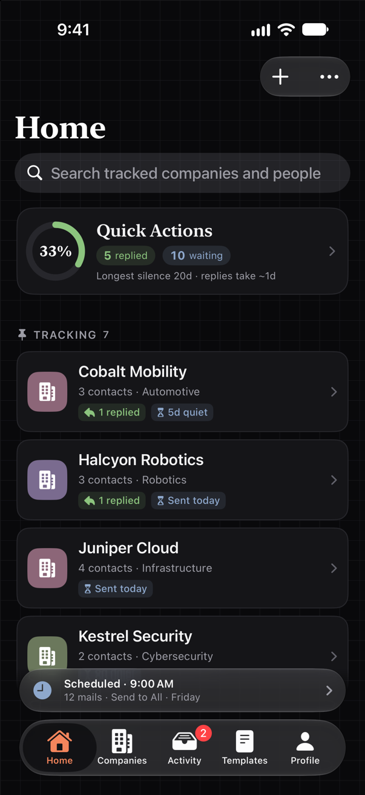<br><sub><b>Home.</b> Tracked companies, the reply rate, and a scheduled batch on the shelf.</sub></td>
    <td align="center" width="25%">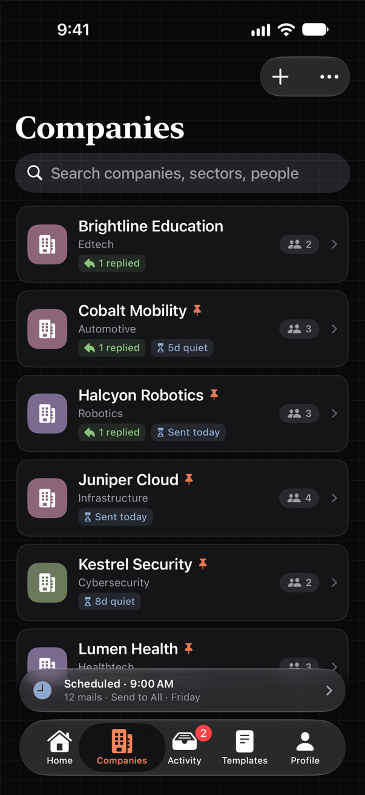<br><sub><b>Companies.</b> The shared catalog, searchable by company, sector or person.</sub></td>
    <td align="center" width="25%">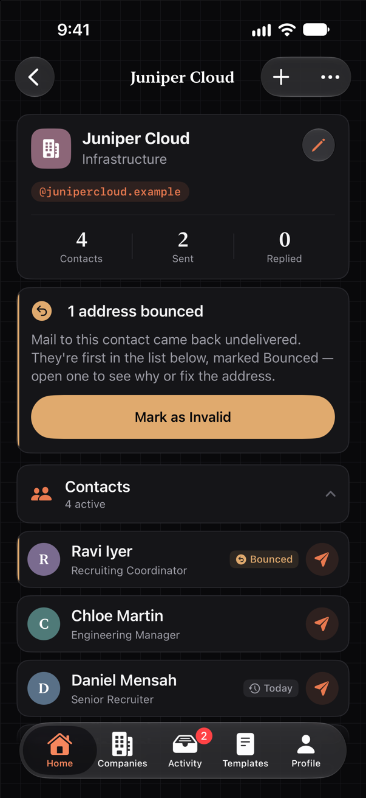<br><sub><b>Company.</b> Its mail domains, counts, and contacts, bounced ones first.</sub></td>
    <td align="center" width="25%">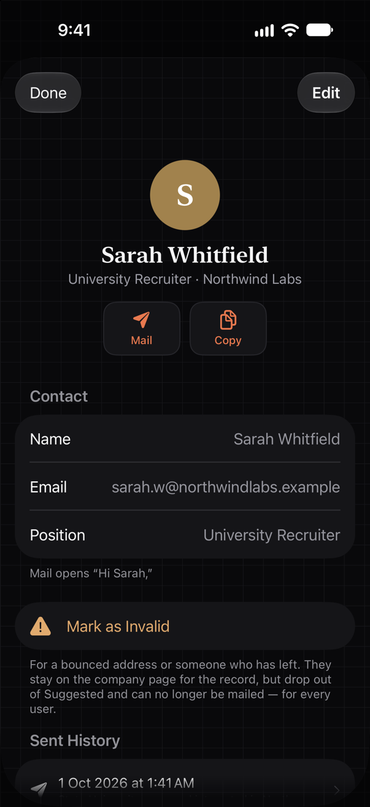<br><sub><b>Contact.</b> Details, the greeting mail will open with, and sent history.</sub></td>
  </tr>
  <tr>
    <td align="center">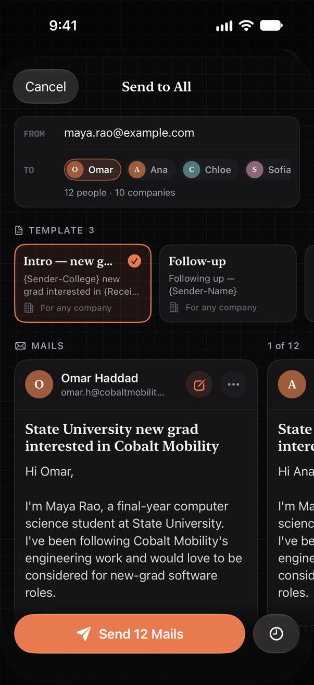<br><sub><b>Compose.</b> Recipients, a row of templates, and a deck of the actual mails.</sub></td>
    <td align="center">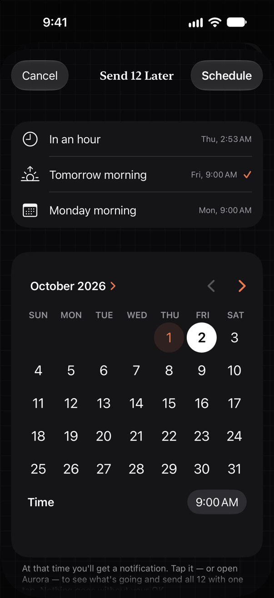<br><sub><b>Schedule.</b> Send later: in an hour, tomorrow, Monday, or any time.</sub></td>
    <td align="center">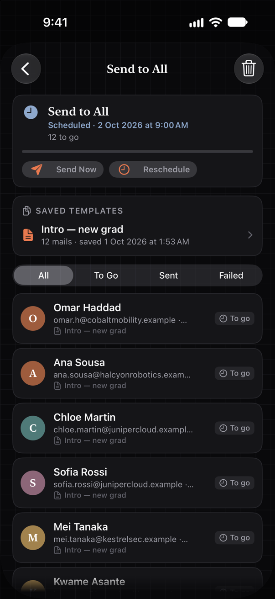<br><sub><b>Mail queue.</b> A batch with its saved templates and each person's status.</sub></td>
    <td align="center">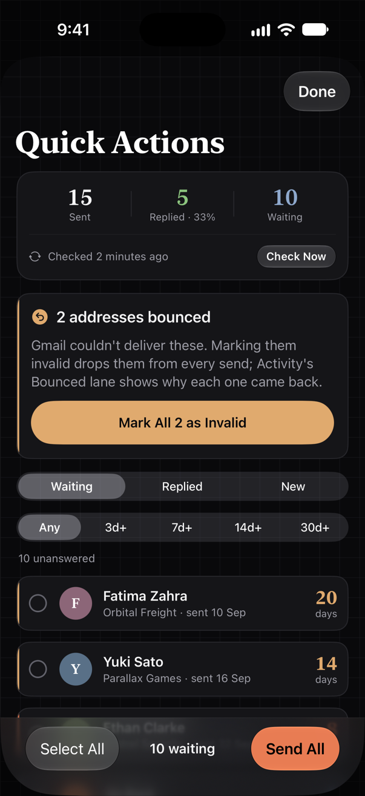<br><sub><b>Quick Actions.</b> Who's waiting, who replied, who's new, ready to send to.</sub></td>
  </tr>
  <tr>
    <td align="center">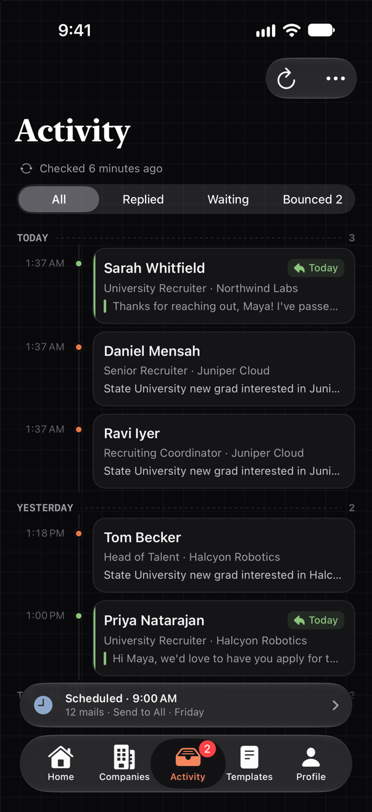<br><sub><b>Activity.</b> Every mail sent, by day, with replies marked.</sub></td>
    <td align="center">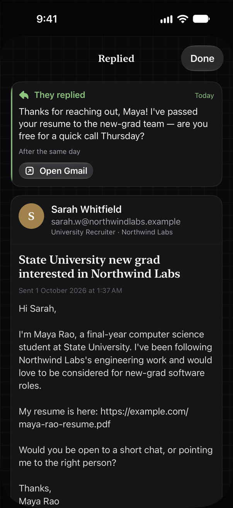<br><sub><b>Reply.</b> What they said, above the mail that was sent.</sub></td>
    <td align="center">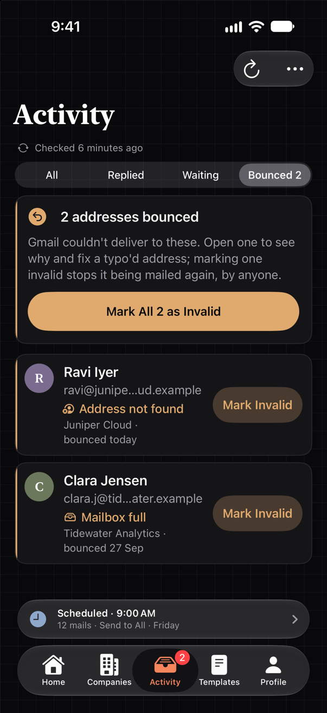<br><sub><b>Bounced.</b> Addresses that came back, with the reason.</sub></td>
    <td align="center">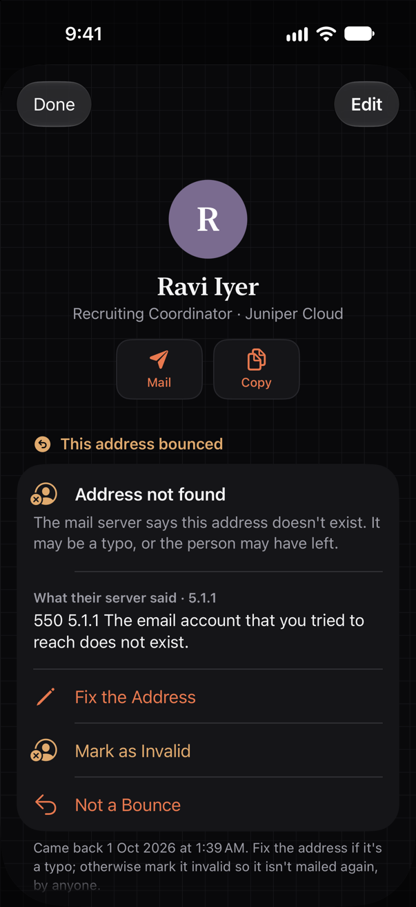<br><sub><b>Bounce.</b> The server's own message, and ways to fix it.</sub></td>
  </tr>
  <tr>
    <td align="center">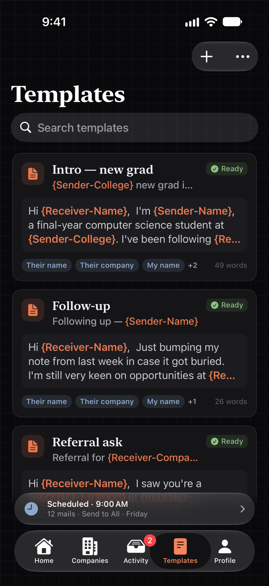<br><sub><b>Templates.</b> Each one's placeholders and whether it's ready.</sub></td>
    <td align="center">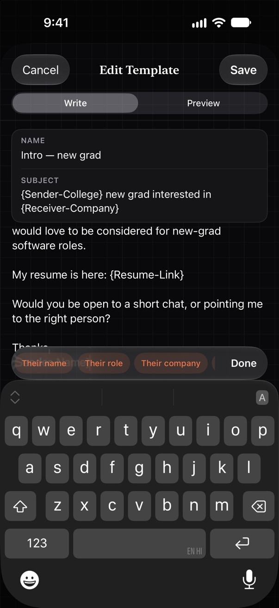<br><sub><b>Editor.</b> Placeholders inserted from the bar above the keyboard.</sub></td>
    <td align="center">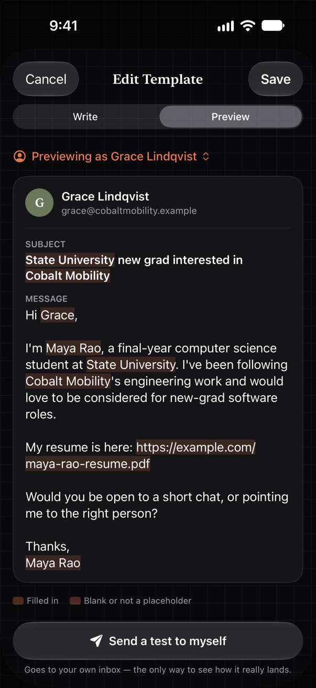<br><sub><b>Preview.</b> The template filled in for one of your contacts.</sub></td>
    <td align="center">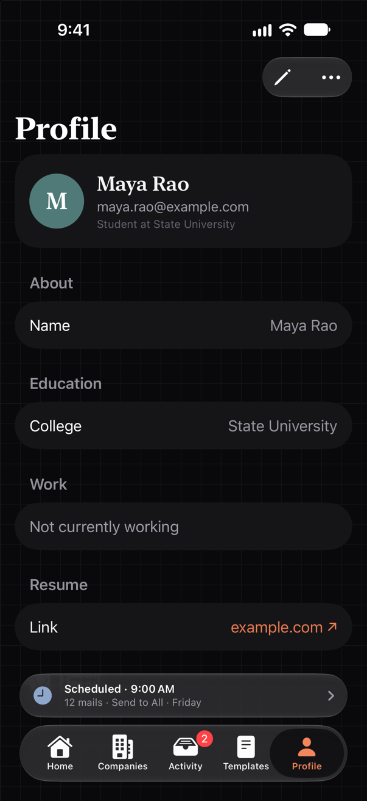<br><sub><b>Profile.</b> The sender details placeholders fill from.</sub></td>
  </tr>
</table>

## How sending works

### Compose

A letter on the compose screen is just a contact plus the template it uses (or
the text you rewrote it with). Its text is only produced when its card is on
screen, so opening a batch of 150 or switching its template doesn't render 150
mails. Blank placeholders, missing subjects and wrong-company templates are
counted without rendering anything, and the send button says what's wrong.

Anyone already waiting in the mail queue is left out of a new batch, with a note
saying how many.

### The queue

Tapping Send (or Schedule) hands the batch to `MailQueue`, which stores it as:

- a copy of each template's subject and body as they were when you confirmed,
- one entry per person: address, name, company, the values their placeholders
  fill with, which template they use (or their hand-written text), and a status.

Each mail is rendered from that copy right before it's sent. Editing a template
afterwards doesn't change a batch that's already queued; what you reviewed is
what goes out. The batch is saved to `Documents/mail-queue-<account>.json`
after every change, at about 600 bytes per person. Finished batches are kept
for a week.

Mails go out one at a time, 1.2 s apart with some random jitter. Gmail would
accept them faster, but a burst of near-identical mail from a personal account
is what spam filters look for, and the damage lands on your own sending
reputation. Personal Gmail accounts can also only send a few hundred messages a
day.

Sends are written to the `mail_sends` history every 5 mails. Anything not yet
written when the app closes is written the next time it opens.

The shelf above the tab bar shows what the queue is doing (sending, paused,
due, scheduled, or the last result). Tapping it opens the queue, where each
batch can be paused, resumed, rescheduled, retried or removed. Each batch lists
the saved copies of its templates (flagged if the template has been edited or
deleted in Templates since), each person's row says which one their mail is
written from, and any mail can be opened to read exactly what was or will be
sent. The queue is also under Activity → ⋯ → Mail Queue.

### Interruptions

A mail is saved as `sending` before the request goes to Gmail and as `sent`
when Gmail answers. If the app is closed in between, nobody knows whether Gmail
got it, and guessing wrong either way is bad: a second mail to the same person,
or a mail that never went.

So on the next launch:

1. Any batch that was mid-send comes back **paused**. It doesn't resume on its
   own.
2. Each mail left as `sending` is looked up in Gmail's Sent mail
   (`in:sent to:<address> after:<time it was handed over>`), after waiting
   ~20 s so Gmail's search has caught up. If it's there, it's marked sent with
   its Gmail ids and recorded. If not, it goes back in line.
3. If the lookup fails because you're offline, the mail stays `sending` and is
   looked up again before anything else happens to it. If it can't be looked up
   at all, it's marked failed and not resent.

Losing the network in the middle of a request is treated the same way: the
batch pauses and that mail is checked on resume instead of being counted as
failed.

Pause (on the shelf or in the queue) lets the mail already in flight finish.
It doesn't cancel the request, because a request cancelled on the phone may
still have been delivered by Gmail.

### Scheduling

The clock button next to Send schedules the batch instead: in an hour,
tomorrow at 9, Monday at 9, or any date and time.

iOS doesn't let an app run at a set time, so scheduling works the way Reminders
does: the app hands iOS a local notification for that time. Tapping it opens the
app on a summary of the batch (how many mails, which companies and templates,
who it's going to, roughly how long it will take) with a Send button. The same
summary appears if you open the app, or already have it open, once the time has
passed. Nothing is sent without that tap. "Not Now" leaves it on the shelf.

If you don't open the app, the batch waits. Sending at an exact time with the
phone locked would need a server holding your Gmail token, which this app
doesn't have.

## Reply tracking

Reply state lives per user on `mail_sends`. `ReplySync` makes two passes over
Gmail:

1. For sends recorded without a thread id, it finds the Sent copy with an exact
   `in:sent to:… after:… before:…` search. If more than one mail could match,
   it leaves the send alone rather than attach the wrong thread.
2. It reads the headers of each unanswered thread and takes the first message
   that isn't yours. Your own messages (`SENT`/`DRAFT` labels), auto-replies
   (`Auto-Submitted`, `Precedence`, no-reply senders) and bounces
   (`mailer-daemon`/`postmaster` senders) are skipped.

Matching by thread instead of by sender address matters: replies often come
from a colleague or an applicant-tracking system, which keep the thread but not
the address.

After a recent sync, the next one only reads threads that received new mail
since then (with a 15-minute overlap). Pulling to refresh in Activity always
does a full check.

### Bounces

A bounce is found two ways during the same sync:

- **In the thread.** A failure notice that Gmail filed with the original mail,
  from a `mailer-daemon` or `postmaster` sender (or Exchange's
  `MicrosoftExchange329e71ec88ae4615bbc36ab6ce41109e` service account). The
  thread already says which send it was.
- **In the inbox.** Many servers send notices that never join the thread. The
  sync searches for the usual senders and the usual subjects ("Undeliverable",
  "Delivery Status Notification", "Returned mail", "Delivery failure", …) from
  the last 120 days, Spam and Trash included. It reads only the notices it
  hasn't seen before.

Either way, the notice is read whole (`format=raw`), not just its preview.
Most notices carry a machine-readable report (RFC 3464) that gives each failed
address, what happened (`Action: failed` or `delayed`), a status code (`5.1.1`)
and the receiving server's own explanation. They also quote the original
mail's `Message-ID`, which a `rfc822msgid:` search turns back into the exact
send. What the app does with that:

- Only `Action: failed` counts. "Delayed" reports are skipped, because Gmail
  is still retrying and most of those mails arrive in the end.
- The reason comes from the status code: `5.1.1` (and Exchange's `5.1.10`)
  address not found, `5.1.2` domain doesn't exist, `x.2.2` mailbox full,
  `5.7.x` rejected by their server's policy or spam filter.
- A notice is matched to the send its `Message-ID` names. Without one, it's
  matched by address, and then only to a contact who was mailed before it
  arrived.
- A mail whose subject says "Returned mail" but isn't a notice (no report, not
  from a mail server, no `X-Failed-Recipients`) is ignored.

Servers that send prose alone fall back to reading the text: the address from
`X-Failed-Recipients` or the prose, the reason from its wording and any status
code in it. All of this lives in `BounceParsing`, which has its own tests.

Bounces are saved per account in `Documents/bounces-<account>.json`, so they
survive a relaunch. A bounce leaves the list when the contact is marked
invalid, when their address is changed, when they reply after it, or when you
tap Not a Bounce. A dismissed contact comes back only if a newer notice
arrives.

## Architecture

| Layer | Where |
|-------|-------|
| UI | SwiftUI, `Aurora/Views`. `RootView` owns the stores and the tab bar. |
| State | `@Observable` stores in `Aurora/Models`: `JobStore`, `ProfileStore`, `TemplateStore`, `GmailAuthStore`, `ReplySync`, `MailQueue` |
| Backend | Supabase (Postgres) through `SupabaseAPI` |
| Mail | Gmail API via `GmailAuthStore`: OAuth with PKCE, send, and read-only mailbox queries |
| On the phone | Keychain for the Google refresh token; JSON files in Documents for the mail queue and a few cached lists (`JSONFile`) |

`MailQueue` and `ReplySync` don't reference the auth or data stores. `RootView`
passes them closures for sending, looking up Sent mail, recording sends and
reading threads. That keeps them independent of Gmail and Supabase, and let the
queue be exercised with a fake transport.

Tables: `companies`, `recruiters` (shared by all users), `mail_sends` (per
user), plus profiles and templates. Sent and reply state is overlaid onto the
shared contact rows after they're loaded.

`recruiters.is_valid` is shared on purpose and only written by
`SupabaseAPI.setContactValidity`, never by an ordinary contact edit. Correcting
someone's address can't quietly put them back in circulation.

## Design

Dark only: a near-black background ruled as faint graph paper, light text, thin
rules, one accent colour (clay). Colours and type are in
`Support/Palette.swift`; surfaces, list styles, buttons, chips, metrics and
selection mode are in `Support/DesignSystem.swift`. Screens use those rather
than choosing their own colours or corner radii.

Conventions the code follows:

- Every card is the same surface, radius and hairline. No shadows.
- Colour only when it means something, shown as a strip down a card's left
  edge: olive for a reply, warmer for a longer silence, kraft for a warning.
- System serif for titles and numbers, system sans for everything else.
- Content is flat; controls floating over it use Liquid Glass.
- Sending, signing out and marking contacts valid/invalid always ask first.
  Editing sheets ask before discarding changes and can't be swiped away while
  they have any (`discardableEdits`).
- System components where they exist: `List` for lists (so swipes, context
  menus and multi-select behave like the rest of iOS), the system segmented
  control, the system bottom toolbar in selection mode.
- Long lists and decks are lazy, and state that changes often (like which
  letter is on screen) is kept where only the views showing it redraw.

## Setup

Requirements: Xcode with the iOS 27 SDK, a Supabase project, and a Google Cloud
OAuth client for iOS.

1. Open `Aurora.xcodeproj`.
2. Fill in [`Aurora/AppConfig.swift`](Aurora/AppConfig.swift):
   - `supabaseURL`, `supabaseAnonKey`
   - `googleClientID`, `googleRedirectScheme` (the reversed client ID)
3. Apply the schema below to your Supabase project.
4. Run on a simulator or device. Scheduled sends ask for notification
   permission the first time you schedule something.

### Database schema

Changes the app expects, newest first. Run them in the Supabase SQL editor; each
is safe to re-run.

```sql
-- Company mail domains (e.g. {stripe.com, stripe.dev}). A company can have
-- several; the app adds a contact's work domain to its company automatically,
-- and suggests the company from the domain when a contact is added. The
-- backfill seeds each company with the work domains its contacts already use.
alter table companies
  add column if not exists domains text[] not null default '{}';
create index if not exists companies_domains_idx on companies using gin (domains);
update companies c
set domains = sub.domains
from (
  select company_id, array_agg(distinct lower(split_part(email, '@', 2))) as domains
  from recruiters
  where email like '%@%.%'
    and lower(split_part(email, '@', 2)) not in (
      'gmail.com', 'googlemail.com', 'yahoo.com', 'yahoo.co.in', 'ymail.com',
      'outlook.com', 'hotmail.com', 'live.com', 'msn.com', 'icloud.com', 'me.com',
      'mac.com', 'aol.com', 'proton.me', 'protonmail.com', 'rediffmail.com',
      'zoho.com', 'gmx.com', 'mail.com', 'yandex.com')
  group by company_id
) sub
where sub.company_id = c.id and c.domains = '{}';

-- Per-contact greeting override: what goes after "Hi " when the name field
-- can't produce it on its own ("A Bagarwal", a role mailbox). Null derives the
-- greeting from the name and address instead.
alter table recruiters
  add column if not exists greeting_name text;

-- Reply tracking. Gmail's ids for each send, and what came back.
alter table mail_sends
  add column if not exists gmail_message_id text,
  add column if not exists gmail_thread_id  text,
  add column if not exists replied_at       timestamptz,
  add column if not exists reply_from       text,
  add column if not exists reply_snippet    text;

create index if not exists mail_sends_thread_idx
  on mail_sends (user_email, gmail_thread_id);

-- Contacts that bounce, or whose owner has left the company.
alter table recruiters
  add column if not exists is_valid boolean not null default true;
```

The app still runs if some of these haven't been applied yet:

- Without `greeting_name`, greetings are worked out from the name and address,
  and a greeting typed into the contact form is dropped while the rest of the
  edit saves.
- Without the reply-tracking columns, sends are recorded without Gmail ids and
  no replies are found. The Quick Actions status line says so.

The mail queue needs no schema change; it's stored on the phone.

### Google OAuth

The app asks for `gmail.send` and `gmail.readonly`. The read scope is what
reply tracking and the queue's Sent-mail lookups use.

- If you connected Gmail before reply tracking existed, disconnect and reconnect
  it in Profile. Older tokens don't have the read scope, and reads fail with a
  403 until you do.
- `gmail.readonly` is a restricted scope. It works for listed test users while
  the consent screen is in Testing. Publishing requires Google's verification
  and a yearly security assessment.
- An OAuth app in Testing gets refresh tokens that expire after seven days.
  When that happens, a running batch pauses and asks you to reconnect.

The Supabase anon key and the Google iOS client ID ship inside the app and
aren't secrets. That means the database's Row Level Security policies are what
actually protect the data. Never commit service-role keys, client secrets or
provisioning profiles.

## Tests and scripts

`Tests/` holds self-contained Swift scripts: reply detection, sync end to end,
pagination, company/undo logic, and a mutation check that breaks the reply
filters on purpose to make sure the tests notice. Most include their own copies
of the logic under test, so they run without Xcode. The bounce tests compile
against the app's own `BounceParsing.swift` instead:

```bash
swiftc Aurora/Models/BounceParsing.swift Tests/BounceParsingTests.swift -o /tmp/bt && /tmp/bt
swift Tests/ReplySyncTests.swift
swift Tests/EndToEndSyncTests.swift
swift Tests/PaginationAndLazyLoadTests.swift
swift Tests/CompanyAndUndoTests.swift
swift Tests/MutationVerifier.swift
```

`scripts/company_verification/` is a Python pipeline that checks and repairs the
shared company/contact catalog (one company per mail domain, typo domains,
dead domains, names). It backs up before every change. See its
[README](scripts/company_verification/README.md).

`scripts/app_icon/make_icon.swift` draws the app icon, one rising curve going
from rose to amber with a glow behind it, and its tinted variant. The usage is
at the top of the file.

The app was called JTracker until September 2026. Its bundle ID is still
`com.realaryan.JTracker`, which keeps it installing over the old app and
matches the iOS OAuth client registered with Google.

## Project layout

```
Aurora/
├─ AuroraApp.swift          App entry; installs the notification delegate
├─ AppConfig.swift          Supabase + Google OAuth configuration
├─ Models/                  Stores, Supabase/Gmail access, mail queue, reply sync
├─ Views/                   SwiftUI screens
├─ Support/                 Design system, palette, keychain, JSON files, haptics
└─ Assets.xcassets/         App icon and colours
Tests/                      Standalone Swift test scripts
scripts/company_verification/  Catalog verification pipeline (Python)
scripts/app_icon/           Draws the app icon (Swift, Core Graphics)
docs/screenshots/           Screenshots used in this README
```

`data_verification/`, `db_backups/` and the CSV exports at the root are
git-ignored because they contain people's addresses and sent mail.
