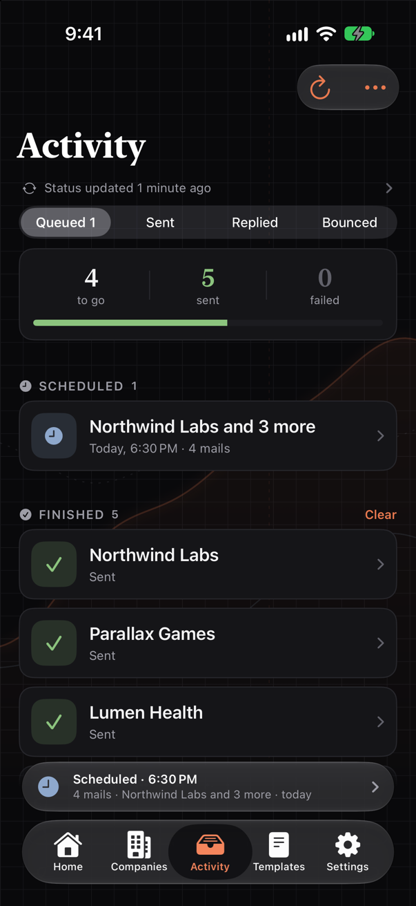
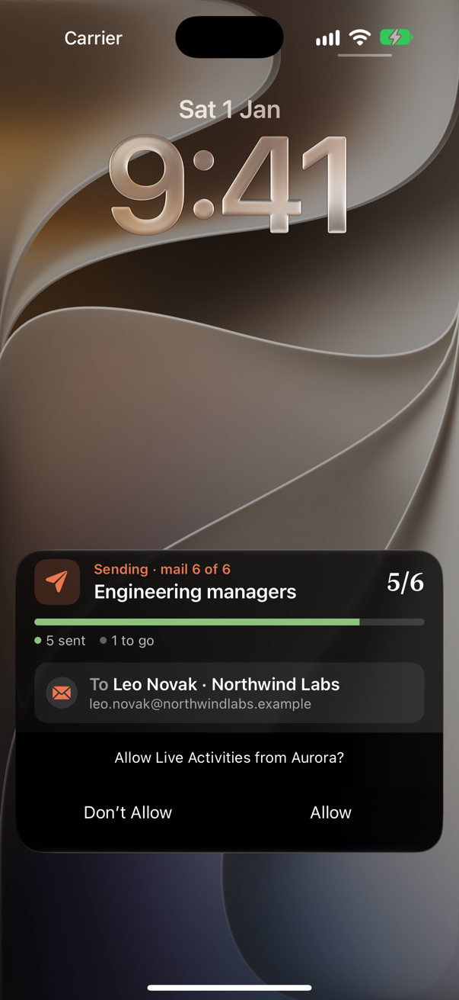
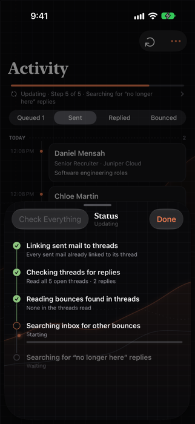
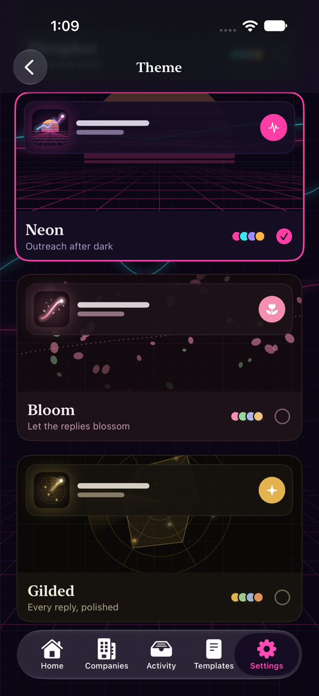

# Screenshots

Taken from a demo account. The companies, people and replies are made up.
Back to the [README](README.md).

<table>
  <tr>
    <td align="center" width="50%"> <b>Home.</b> Tracked companies, and a scheduled batch on the shelf.</td>
    <td align="center" width="50%"> <b>Company.</b> Its mail domains, counts, and contacts split into Valid and Invalid; one with no name says so.</td>
  </tr>
  <tr>
    <td align="center" width="50%"> <b>Compose.</b> Recipients, a row of templates, and a deck of the actual mails.</td>
    <td align="center" width="50%"> <b>Templates.</b> Each one's placeholders and whether it's ready.</td>
  </tr>
  <tr>
    <td align="center" width="50%"> <b>Queued.</b> The mail queue in Activity: a scheduled batch, and finished ones listed by company.</td>
    <td align="center" width="50%"> <b>Live Activity.</b> Status, progress, and the company and address the mail is going to.</td>
  </tr>
  <tr>
    <td align="center" width="50%"> <b>Sent.</b> Every mail sent, by day, under the status line.</td>
    <td align="center" width="50%"> <b>Reply.</b> What they said, above the mail that was sent.</td>
  </tr>
  <tr>
    <td align="center" width="50%"> <b>Bounced.</b> Addresses that came back, including one whose company answered that it's no longer in service.</td>
    <td align="center" width="50%"> <b>Bounce.</b> The server's own message, and ways to fix it.</td>
  </tr>
  <tr>
    <td align="center" width="50%"> <b>Status.</b> The latest check as a timeline: done, running, still to come.</td>
    <td align="center" width="50%"> <b>Lock Screen.</b> The company the mail is going to, and who.</td>
  </tr>
  <tr>
    <td align="center" colspan="2"> <b>Themes.</b> Each one live, with its own chart, colours and icon.</td>
  </tr>
</table>
